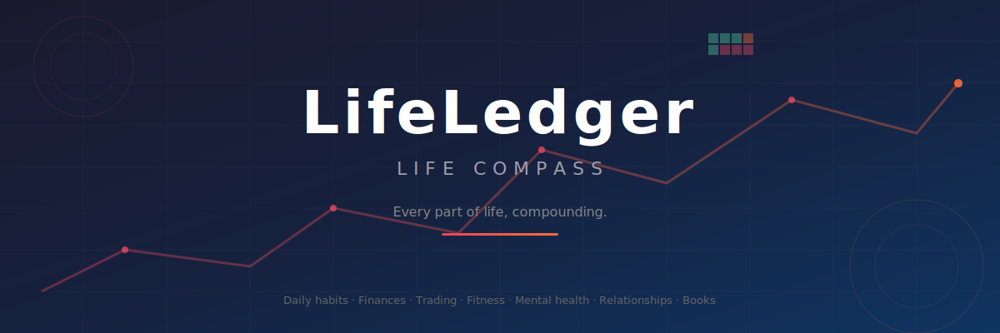

<div align="center">
  
</div>

<br>

<div align="center">

### 🧭 **Track everything. Improve anything. Start today.**

</div>

> I built **LifeLedger** because I believe **anyone can improve their life — starting today**. It's one thing to *want* to get better at fitness, finances, relationships, and habits — it's another to have a single place that shows you the raw truth of where you are and where you're heading. This dashboard is my personal command center for that journey. Every number, every streak, every green square is proof that small daily actions compound into real change. If this inspires you to build something similar for yourself, that's exactly why it exists.

---

## ✨ What It Does

LifeLedger is a **personal life dashboard** that logs and visualises everything that matters. It replaces a dozen apps and spreadsheets with one unified view of your life.

| Tab | 🎯 What It Tracks |
|-----|-------------------|
| **Dashboard** 🏠 | Net worth, projected interest, monthly net, green streak, today's tasks, life spent |
| **Daily Log** 📋 | Tasks (set before 9AM 🕘 Dutch time), workouts 💪, reflections — earn "fully green" days 🌱 |
| **Life in Weeks** 📅 | A grid of ~85 years; every square is one week. **See how much time you have left** |
| **Finances** 💰 | Savings accounts with APY, income/expenses, blended interest rate, net worth |
| **Trading Desk** 📈 | Live crypto prices (CoinGecko), simulated stocks/forex/indices, full trade journal with P&L |
| **Business Tracker** 🏢 | Ventures with revenue/costs/profit, social media accounts with followers |
| **Growth** 📊 | Gym lifts 🏋️, net worth, IQ, focus — charted over time with Recharts |
| **Mental Health** 🧠 | Mood, energy, stress, sleep, meditation — daily ratings that reveal trends |
| **Relationships** ❤️ | People with closeness (1-10), interaction logs with quality ratings |
| **Books** 📚 | 3-shelf tracker: To Read / Reading / Finished, with page progress and star ratings |

---

## 📸 Screenshots

> *Screenshots will be added once the development server is running and the app is populated with real data.*

<div align="center">
  <table>
    <tr>
      <td align="center"><b>Dashboard 🏠</b></td>
      <td align="center"><b>Daily Log 📋</b></td>
      <td align="center"><b>Life in Weeks 📅</b></td>
    </tr>
    <tr>
      <td></td>
      <td></td>
      <td></td>
    </tr>
    <tr>
      <td align="center"><b>Finances 💰</b></td>
      <td align="center"><b>Trading Desk 📈</b></td>
      <td align="center"><b>Business Tracker 🏢</b></td>
    </tr>
    <tr>
      <td></td>
      <td></td>
      <td></td>
    </tr>
    <tr>
      <td align="center"><b>Growth 📊</b></td>
      <td align="center"><b>Mental Health 🧠</b></td>
      <td align="center"><b>Relationships ❤️</b></td>
    </tr>
    <tr>
      <td></td>
      <td></td>
      <td></td>
    </tr>
    <tr>
      <td align="center" colspan="3"><b>Books 📚</b></td>
    </tr>
    <tr>
      <td align="center" colspan="3"></td>
    </tr>
  </table>
</div>

---

## 🛠️ Tech Stack

| Layer | Technology |
|-------|-----------|
| **Frontend** 🎨 | React 19, Tailwind CSS 3.4, shadcn/ui, Recharts, Framer Motion |
| **Backend** ⚙️ | FastAPI (Python), Motor (async MongoDB) |
| **Database** 🗄️ | MongoDB |
| **Auth** 🔐 | JWT + bcrypt, single admin user seeded via environment |

---

## 🚀 Getting Started

### Prerequisites

- Node.js 18+
- Python 3.10+
- MongoDB (local or Atlas)

### 1. Clone

```bash
git clone https://github.com/BobaSipp/LifeCompass.git
cd LifeCompass
```

### 2. Install dependencies

```bash
# Frontend
cd frontend
npm install --legacy-peer-deps

# Backend
cd ../backend
pip install -r requirements.txt
```

### 3. Configure environment

**Backend** — create `backend/.env`:
```env
MONGO_URL=mongodb://localhost:27017
DB_NAME=lifeledger
JWT_SECRET=your-secret-key-change-this
ADMIN_EMAIL=admin@example.com
ADMIN_PASSWORD=your-admin-password
CORS_ORIGINS=http://localhost:3000
```

**Frontend** — create `frontend/.env`:
```env
REACT_APP_BACKEND_URL=http://localhost:8000
```

### 4. Start the backend

```bash
cd backend
uvicorn server:app --reload
```

The API starts at `http://localhost:8000`. On first run it seeds the admin user from `ADMIN_EMAIL` / `ADMIN_PASSWORD`.

### 5. Start the frontend

```bash
cd frontend
npm start
```

Open **http://localhost:3000** in your browser 🎉

---

## 🔑 How It Works

### Auth model

Only the single admin (seeded via `ADMIN_EMAIL` / `ADMIN_PASSWORD` at startup) can edit data. All other visitors see the dashboard in **read-only mode**. Buttons are visible to everyone, but write operations require a valid admin JWT — enforced server-side.

### Data flow

The React frontend talks to the FastAPI backend via REST. The backend reads/writes to MongoDB. Live crypto prices are fetched from the CoinGecko API (cached 20s). Stocks, forex, indices use a deterministic simulation seeded by the date and symbol — prices drift daily and oscillate intraday.

### Daily log 9AM rule ⏰

Tasks must be set before **09:00 Dutch time**. If they are, *and* all tasks are completed, the day turns **fully green** 🌱. If tasks are set after 9AM, the day can only reach "partial" or "logged" status — never green.

---

## 🌐 Deployment

### Frontend (GitHub Pages)

```bash
cd frontend
npm run build
npm run deploy
```

This builds the React app and pushes the `build/` folder to the `gh-pages` branch.

### Backend

Deploy to any Python host (Railway, Render, Fly.io, etc.). Requires MongoDB Atlas for the database. Set the same environment variables as in `backend/.env`.

---

## 📁 Project Structure

```
LifeCompass/
├── backend/
│   ├── server.py              # FastAPI app — all endpoints
│   ├── requirements.txt        # Python dependencies
│   └── tests/
│       └── backend_test.py     # Pytest integration tests
├── frontend/
│   ├── public/
│   │   └── index.html          # HTML template
│   ├── src/
│   │   ├── components/         # Reusable UI (Layout, Sidebar, StatCard, MetricChart)
│   │   ├── context/            # AuthContext (JWT-based auth)
│   │   ├── lib/                # API client, utils, live quotes hook
│   │   ├── pages/              # All 11 page components
│   │   └── constants/          # Test IDs
│   ├── craco.config.js         # CRACO override config
│   └── package.json
├── docs/screenshots/           # Screenshots for the README
├── README.md
└── .gitignore
```

---

<div align="center">

**Made with ❤️ because every day is a chance to be a little better than yesterday.**

[](https://github.com/BobaSipp/LifeCompass)

</div>
